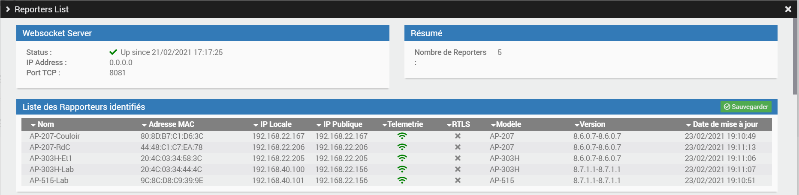

# Jeedom ArubaIot Plugin

ArubaIot is a Jeedom plugin which implements a gateway role for Aruba Access Point (AP) IOT capabilities.
Today, ArubaIoT supports BLE capabilities of AP, and can understand few, wellknown devices : Aruba Tags, Enocean BLE Switch, Enocean BLE Sensor, some generic BLE devices.


## Requirements

You need to have a Jeedom ! (see https://www.jeedom.com).

## Documentation

### Introduction

The plugin is supporting the following type of BLE objects. For each object is specified the list of supported info command.
- enoceanSensor (illumination, occupancy)
- enoceanSwitch (switch_bank_1, switch_bank_2)
- arubaTag (presence, rssi, nearest_ap)
- arubaBeacon (rssi)
- generic (presence)

### Plugin Configuration

The following attributes can be configured :

- Presence Timeout ('presence_timeout') :
The minimun value (in second) after which the device can be set to presence=0 (absence).

- Reporters Access Token :
The access token that will be configured in the Aruba AP. If empty, no access token will be verified.

- Reporters Allow List :
A comma separated list of reporters MAC@ (format AA:BB:00:00:00:00, with capitals) allowed to send telemetry data. If the list is empty
all reporters are accepted.

- Nearest Reporter Timeout :
The time in sec after which the nearest reporter is reset by a better one when no updated information received from it for a device.

- Minimum RSSI to become a Nearest Reporter :
The minimum RSSI value in dbm to declare a reporter the current nearest reporter.

- Nearest Reporter RSSI hysteresis interval :
The minimum incremental value in dbm of the RSSI to declare a reporter a better reporter than the current nearest reporter. This value allow to implement an hysteresis cycle, and lower the flip-flap that may occur when 2 reporters report a very similar RSSI.

- Maximum number of Reporters for triangulation :
The maximum number of reporters that are taken into account in the triangulation command for a device. The reporters are sorted to keep the N Reporters with best RSSI.

- Websocket IP Address :
The local IP address of the websocket in the jeedom. If 0.0.0.0, then will use the local IP address, no need to know it to start.

- Websocket TCP Port :
The TCP port where the jeedom will receive the connections. By default 8081. Must be a valid TCP port. If daemon fails to
connect then try an other free TCP port.


### Adding New Devices

To add new devices, click on the Add button and give a name for the device. You must then give a valid MAC@ of the device.
You can also give the type of object from the dropdown list. If you select "auto" then the daemon will learn the device type
when receiving the first telemetry frame.
Depending of the device type, some command information will be initiated for the device. Others will be automatically learnt when
receiving the telemetry frames from the device.


### Include Mode

To simplify the on-boarding of new device, you can select the "Include mode".

When starting the include mode, a popup window will ask for the type of devices that need to be included. All new devices compliant with the types selected will be added when receiving new telemetry data.

The include mode need to be disabled manually.

Refresh the page to see the updated list of new devices.


### Other screenshots

Reporters List and Status :



Reporters Statistics :


Devices Visibility


Enocean Illumination History


Device batteries follow-up


---

### Aruba IOT Configuration Example

Below is an example of an Aruba IAP configuration to have the IOT Gateway sending telemetry data to ArubaIot Plugin.

Please notice that URI "/telemetry" is used for the endpointURL. For all other attributes of the transportProfile, please refer to Aruba documentation. The right configuration will improve the load on the Jeedom box.


```cli
iot radio-profile Test
radio-mode ble

iot use-radio-profile Test

iot transportProfile Test
endpointType telemetry-websocket
payloadContent managed-beacons
payloadContent managed-tags
payloadContent enocean-switches
payloadContent enocean-sensors
endpointURL ws://<jeedom_ip_address>:8081/telemetry
endpointToken 12346
transportInterval 60

iot useTransportProfile Test
```

When using generic BLE devices, the following configuration could be used :

```cli
iot radio-profile Test
radio-mode ble

iot use-radio-profile Test

iot transportProfile Test
endpointType telemetry-websocket
payloadContent managed-beacons
payloadContent managed-tags
payloadContent enocean-switches
payloadContent enocean-sensors
endpointURL ws://<jeedom_ip_address>:8081/telemetry
endpointToken 12346
transportInterval 60

bleDataForwarding
macOuiFilter A4C138,E6FE37

iot useTransportProfile Test
```

Please replace MAC@ prefixes A4C138,E6FE37 by the right ones.

## Change Logs

Release v1.2 (beta) :
- Bug correction : use of telemetry value 'txpower' is crashing daemon because of missing/bad default value.

Release v1.1 (beta) :
- Correct upgrade of dependency and daemon process

Release v1.0 (beta) :
- Enable "dependence" feature of Jeedom. Isolate websocket server (AWSS) code download from jeedom plugin code.
- Support for BLE advertissements. Which allow for Xiaomi temperature sensors, and Jinou temperature sensors.
- Support for Aruba Websocket Server 1.2-beta
- Code improvement to use a more generic websocket code, and have jeedom implementation as an extension.
- Support for ArubaOS 8.8 software
- Adding support for BLE Gatt protocol in websocket server

Release v0.7 (beta) :
- Add new configuration parameters for triangulation : triangulation_timeout and triangulation_min_rssi.
- Add new configuration parameters for presence calculation tuning : 'presence_min_rssi', 
'presence_rssi_hysteresis'
- Change in presence calculation. Starting 0.7, the presence calculation is
dissociated from the nearestAP and latest RSSI calculation.

Release v0.6 (beta) :
- Add statistics for reporters. This might be usefull for knowing bandwidth
consuption of IOT telemetry between each AP and the websocket.
- Add filtering option when starting the inclusion mode. This will mainly limit
 the number of generic BLE devices auto inserted.
- Add a counter with number of new detected devices while in insertion mode.
- Adding additional telemetry data as commands (not tested in real life)
- Code optimisation (easier to add commands in the future)
- Change in presence and nearestAP : a minimum RSSI value can be configured to
  become a nearestAP. Bellow this value the nearestAP command will not be set (or
  nearestAP swaped). Initial presence value will be triggered with same minimum
  RSSI. However as soon as the AP is the nearest, any RSSI value will update the
  timer and the presence flag.
- Changing nearestAP value to be AP name rather than MAC@ (could be a configuration option in the future)
- Improve presence algo : store presence when received telemetry data from a not nearestAP.
- Improve interupt call (every 10sec) to lower the absence detection time.
- Change the way commands are auto learn for a device. When a device is created some
mandatory commands are created, commands are detected during the insertion mode,
and each device can be configured to auto learn new commands or not.
- Bug : update timestamp value in triangulation, even when RSSI is same value.
  Previously when RSSI is same, no update at all.

Release v0.5 (beta) :
- Add a modal to display the actives reporters
- Add a "nearest ap" concept to remove the duplicate telemetry data received from several AP
- Add triangulation data in a dedicated command. Could be used for future, or by scripts.
- Improve include mode, to select which device class to include.

Release v0.4 (beta) :
- Adding images for some of the BLE devices supported (Enocean, Aruba Tags)
- change the way plugin configuration is made
- Change the way devices are displayed in the plugin list
- Add enforcement of the access token for reporters

Release v0.3 (beta) :
- Adding systematic auto-add of commands for an equipement, when receiving the corresponding telemetry data
- Adding a filtering capabilities to deny some commands for specific object classes (no auto-add). Today static in method isAllowedCmdForClass()
- Adding support of comma separated list of reporters' mac@ allowed. If list is empty then all reporters are allowed.
- Adding support for multiple connections coming from same AP. This will allow future use of Telemetry/RTLS data including WiFi device connectivity.
- Modify the way presence/absence is updated


Release v0.2 (beta) :
- Adding support for inlusion mode of scanned devices
- Improve start/stop of websocket daemon
- Add an API communication channel between jeedom plugin and websocket daemon

Release v0.1 :
- First release


## Known Caveats

As of Release v0.6, known caveats are :
- /!\ Only ws:// is supported today by the websocket daemon, which means communication is in clear. No support yet of wss:// with certificate.
- The plugin is managing only part of the north bound Aruba API, it doesn't work with the south bound API (no use of GATT communication with BLE devices).
- When an access point is removed, the telemetry connexion status are not updated in the reporters list. (Cosmetic)


## Technical Aspects

### Presence calculation

Presence of a device is calculated following these rules :
- When a device is missing (or not yet present), when a telemetry payload is 
received with a timestamp inside the "Presence Timeout" interval (configurable)
and when the RSSI is better than the configured value 'presence_min_rssi', 
then the status is changed to "presence".
- When a device is in "presence" status, when a telemetry payload is received
with a timestamp inside the 'presence_timeout' interval (configurable) and when 
the RSSI is better than the configured value "Minimum NearestAP RSSI" minus 
the 'presence_rssi_hysteresis' then the presence timestamp 
is updated, and the presence status do not change.  


### Nearest AP calculation


### Behind the Scene

Explanation of some principles behind all this.

The main role of the Plugin is to receive the telemetry data, and transform it to jeedom info values.

But keep in mind the following points to understand what is the problem to be solved :

The Aruba AP is doing a caching of BLE frames received for a configurable aging timer (attribute "ageFilter" in IAP
configuration from 0 to 3600 sec) before sending a telemetry frame in the websocket connection. It will also resend the same
data until the expiration of the agingTimer.
The plugin daemon, will use the 'lastseen' value of the telemetry data in order to manage the presence/absence flag. It will
update in a regular basis the presence flag when no more telemetry data is received for a configurable period of time.

Moreover by the broadcast nature of BLE, and the fact that an Aruba IAP network may be composed of several Access Point,
the same BLE frame will be received by several AP (known as IOT reporters), each reporter will report it to the daemon.
There is no sequence number nor easy way to identified the duplicated frames.
In order to manage this, the daemon is keeping memory of the Reporter with the best RSSI, and update it when needed
(important for moving devices). Only telemetry data from the nearest reporter are taken into account.
However the deamon is also keeping some informations from the other reporters, specifically in order to manage the triangulation
information.

When started, the daemon load the list of active devices, and some configuration values (ip address, tcp port, timers, ...).
The websocket daemon start listening to the ip:port configured.
When a connection occurs, the daemon perform the handcheck mecanism of the websocket standard with the client.
It then waits for data coming from this connection.
When receiveing data, it decodes the protobuf messages. In this message, the reporter (the Aruba Access Point) gives its
properties (mac@, name, software version, local IP@, ...).
If the reporter is new, a local reporter object is created in the daemon, for storing the properties. The connection is then associated
to this reporter.

The telemetry data are then decoded, and for each mac@, the daemon perform the following tasks :
- look if the device is known or not. If not, and the include_mode is on, and device class allowed, then it creates a new
device in the jeedom DB.
- Then on each telemetry element of the data frame :
  - look if a command exists for the telemetry element (exemple : illumination), if not create the command (illumination)
  for the object
  - update the command with the latest value

When a changes occurs at the device level in jeedom (new, updated, removed device), jeedom is sending an API message to the
daemon to update the information.
Same for changing settings like incude_mode on/off.

